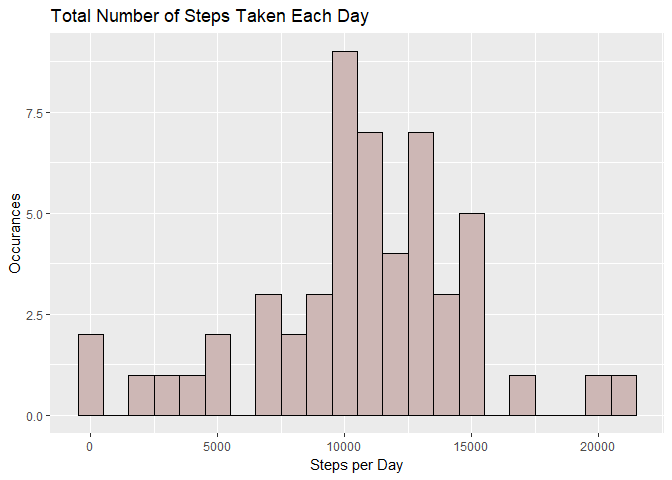

# Assignment 1 Reproducible Research
Cristian Gutierrez  
21 de marzo de 2018  
Loading and preprocessing the data


```r
library(dplyr)
```

```
## Warning: package 'dplyr' was built under R version 3.4.3
```

```
## 
## Attaching package: 'dplyr'
```

```
## The following objects are masked from 'package:stats':
## 
##     filter, lag
```

```
## The following objects are masked from 'package:base':
## 
##     intersect, setdiff, setequal, union
```

```r
library(ggplot2)
```

```
## Warning: package 'ggplot2' was built under R version 3.4.3
```

```r
library(knitr)
library(lubridate)
```

```
## Warning: package 'lubridate' was built under R version 3.4.3
```

```
## 
## Attaching package: 'lubridate'
```

```
## The following object is masked from 'package:base':
## 
##     date
```

```r
library(scales)
```

```
## Warning: package 'scales' was built under R version 3.4.3
```

```r
activity <- read.csv("activity.csv",header = TRUE, sep = ',')
activity$date <- ymd(activity$date)
steps <- activity %>% 
  filter(!is.na(steps)) %>%
  group_by(date) %>% 
  summarize(steps = sum(steps))
```

```
## Warning: package 'bindrcpp' was built under R version 3.4.3
```
What is mean total number of steps taken per day?

```r
ggplot(steps, aes(x = steps)) +
  geom_histogram(fill = "mistyrose3", col=I("black"), binwidth = 1000) +
  labs(title = "Total Number of Steps Taken Each Day",
       x = "Steps per Day", 
       y = "Occurances")
```

<!-- -->
Calculate and report the mean and median of the total number of steps taken per day

```r
mean.steps <- round(mean(steps$steps, na.rm=TRUE))
median.steps <- round(median(steps$steps, na.rm=TRUE))
median.steps
```

```
## [1] 10765
```
What is the average daily activity pattern?

```r
activity$interval <- as.POSIXct(strptime(sprintf("%04d", activity$interval), "%H%M"))
interval <- activity %>% 
  filter(!is.na(steps)) %>% 
  group_by(interval) %>% 
  summarize(steps = mean(steps))
```
 Make a time-plot of the 5-minute interval and average number of steps taken, averaged across all days

```r
ggplot(interval, aes(x=interval, y=steps)) +
  geom_line(color = "mistyrose4") +
  scale_x_datetime(breaks = date_breaks("2 hour"), 
                   labels = date_format("%H:%M"),
                   limits = c(interval$Interval[1], interval$Interval[288])) +
  labs(title = "Average Number of Steps taken (Averaged Across All Days)", 
       x = "Time of Day", 
       y = "Average Steps")
```

```
## Warning: Unknown or uninitialised column: 'Interval'.

## Warning: Unknown or uninitialised column: 'Interval'.
```

<!-- -->
 Which 5-minute interval, on average across all the days, contains the maximum number of steps?

```r
max.interval <- interval[which.max(interval$steps),]
paste("The interval with the maximum number of steps is",
      round(max.interval$steps[1]), "at",
      strftime(max.interval$interval[1], format="%H:%M:%S"))
```

```
## [1] "The interval with the maximum number of steps is 206 at 08:35:00"
```
 Calculate and report the total number of missing values in the dataset

```r
missing.steps <- sum(is.na(activity$steps))
missing.steps
```

```
## [1] 2304
```
 Devise a strategy for filling in all of the missing values in the dataset.

```r
tofill.activity <- activity
missing.activity <- is.na(tofill.activity$steps)
mean.interval <- tapply(tofill.activity$steps,
                        tofill.activity$interval, 
                        mean, na.rm=TRUE, simplify=TRUE)
```
Create a new dataset (equal to the original) but with the missing data filled in

```r
tofill.activity$steps[missing.activity] <- mean.interval[as.character(tofill.activity$interval[missing.activity])]
```
Make a histogram of the total number of steps taken each day

```r
   filled_steps <- tofill.activity %>%
        filter(!is.na(steps)) %>% 
            group_by(date) %>% 
                summarize(steps = sum(steps))
ggplot(filled_steps, aes(x = steps)) +
  geom_histogram(fill = "mistyrose3",colour="Black",binwidth = 1000) +
  labs(title = "Total Number of Steps Each Day (missing values replaced)", 
       x = "Steps per day",
       y = "Occurances")
```

<!-- -->
Calculate and report the mean and median total number of steps taken per day

```r
mean.steps <- round(mean(filled_steps$steps, na.rm=TRUE))
median.steps <- round(median(filled_steps$steps, na.rm=TRUE))
median.steps
```

```
## [1] 10766
```
Do these values differ from the estimates from the first part of the assignment?

```r
imputed <- mutate(tofill.activity, 
                  weektype = ifelse(weekdays(tofill.activity$date) == "Saturday" |
                                      weekdays(tofill.activity$date) == "Sunday", "Weekend", "Weekday"))
imputed$weektype <- as.factor(imputed$weektype)
imputed.full <- imputed %>%
  group_by(interval, weektype) %>%
  summarise(steps = mean(steps)) 
ggplot(imputed.full, aes(x=interval, y=steps, color = weektype)) +
  geom_line(color = "mistyrose4") +
  facet_wrap(~weektype, ncol = 1, nrow=2)+
  scale_x_datetime(breaks = date_breaks("2 hour"),
                   labels = date_format("%H:%M"),
                   limits = c(imputed.full$Interval[1],
                              imputed.full$Interval[288])) +
  labs(title = "Average Number of Steps taken (Weekdays vs. Weekends)",
       x = "Time of Day", 
       y = "Average Steps")
```

```
## Warning: Unknown or uninitialised column: 'Interval'.

## Warning: Unknown or uninitialised column: 'Interval'.
```

<!-- -->
To submit the assignment:
Commit your completed PA1_template.Rmd file to the master branch of your git repository (you should already be on the master branch unless you created new ones). Commit your PA1_template.md and PA1_template.html files produced by processing your R markdown file with knit2html() function in R (from the knitr package) by running the function from the console.
                


